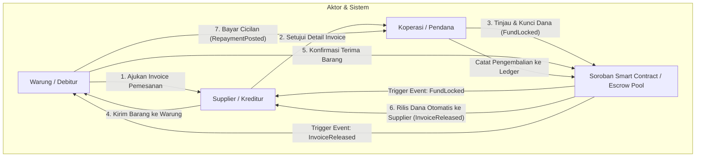

# Warung Supplier Credit (WSC)

Invoice financing demo untuk stok warung: UI tetap Rupiah-facing, Stellar/Soroban menjadi settlement, escrow, dan trust layer di belakang layar.

---

## 📌 Deskripsi Singkat
**Warung Supplier Credit (WSC)** adalah platform demo *invoice financing* yang dirancang khusus untuk mempermudah permodalan stok barang dagang warung kelontong. Sistem ini mengintegrasikan antarmuka pengguna berbasis Rupiah (fiat-facing) dengan smart contract **Stellar/Soroban** yang bertindak sebagai settlement, escrow, dan penjamin keamanan transaksi (trust layer) terdesentralisasi di latar belakang.

---

## 🔍 Akar Permasalahan & Solusi

### Akar Permasalahan (Root Cause)
1. **Keterbatasan Arus Kas Warung**: Warung kelontong sering kali kesulitan membeli stok barang dagang dari supplier dalam jumlah besar karena modal yang terikat pada piutang pelanggan atau penjualan harian.
2. **Kebutuhan Tenor & Keamanan Supplier**: Warung membutuhkan waktu (tenor) untuk membayar barang, sedangkan Supplier membutuhkan kepastian pembayaran saat barang dikirim agar operasional mereka tetap terjaga.
3. **Kendala Transparansi & Biaya Escrow**: Membangun sistem pendanaan (invoice financing) tradisional membutuhkan pihak ketiga (escrow) yang berbiaya mahal serta rentan terhadap manipulasi pencatatan status pembiayaan dan pembayaran cicilan.

### Solusi Aplikasi
1. **Multi-Role Financing Ecosystem**: Menghubungkan Warung, Supplier, dan Koperasi dalam satu alur kerja pembiayaan yang efisien.
2. **Rupiah-Facing UI**: Pengalaman pengguna dioptimalkan dengan tampilan nilai Rupiah agar mudah dipahami oleh pemilik warung lokal di Indonesia.
3. **Decentralized Escrow (Stellar/Soroban)**: Menggunakan smart contract (`pool_escrow`) di jaringan Stellar untuk mengunci dana permodalan dari Koperasi secara aman, menyalurkan pembayaran instan ke Supplier secara otomatis setelah barang terkonfirmasi, dan melacak cicilan pengembalian dari Warung secara permanen (immutable).

---

## 👥 Aktor & Peran

1. **Warung (Debitur/Pembeli)**:
   - Mengajukan invoice pemesanan stok barang ke platform untuk dibiayai.
   - Melakukan konfirmasi penerimaan barang dagang secara digital.
   - Membayar cicilan tenor pembiayaan secara berkala.
2. **Supplier (Kreditur/Penjual)**:
   - Menyediakan stok barang dagang untuk Warung.
   - Menyetujui keabsahan invoice pesanan.
   - Menerima pencairan dana instan langsung dari escrow pool Soroban begitu barang dikonfirmasi sampai.
3. **Koperasi (Lender/Pendana)**:
   - Menyediakan pool likuiditas pendanaan (Rupiah yang disimulasikan).
   - Meninjau pengajuan kredit dari Warung.
   - Menyetujui pembiayaan dengan mengunci dana ke dalam smart contract Soroban.

---

## 📐 Alur Arsitektur Aplikasi

Alur kerja transaksi pembiayaan menggunakan *Stellar/Soroban Smart Contract* digambarkan melalui diagram berikut:



---

## 🚀 Panduan Menjalankan Project

Project ini disarankan dijalankan dengan dua environment terpisah:
- **Frontend React/Vite**: Di Windows PowerShell.
- **Smart contract Stellar/Soroban**: Di Ubuntu/WSL.

### 1. Frontend di Windows

Buka PowerShell di folder project Windows:

```powershell
cd D:\project_yosua\stellar\warung-supplier-credit
pnpm install
pnpm run dev
```

URL default:
```text
http://localhost:3000
```

Build dan linting frontend:
```powershell
pnpm run lint
pnpm run build
```

*(Jika PowerShell tidak mengenali `pnpm`, jalankan `corepack enable` terlebih dahulu)*.

### 2. Environment Frontend

Buat file `.env.local` dari `.env.example`:

```powershell
Copy-Item .env.example .env.local
```

Untuk mode demo tanpa koneksi live contract (menggunakan mock data):
```env
VITE_ENABLE_LIVE_STELLAR="false"
VITE_STELLAR_NETWORK="testnet"
VITE_STELLAR_RPC_URL="https://soroban-testnet.stellar.org"
VITE_STELLAR_HORIZON_URL="https://horizon-testnet.stellar.org"
VITE_WSC_POOL_ESCROW_CONTRACT_ID=""
```

Setelah Anda berhasil melakukan deploy contract dari Ubuntu/WSL, ubah pengaturannya:
```env
VITE_ENABLE_LIVE_STELLAR="true"
VITE_WSC_POOL_ESCROW_CONTRACT_ID="CXXXXXXXXXXXXXXXXXXXXXXXXXXXXXXXXXXXXXXXXXXXXXXXXXXXXXXX"
```

*Catatan: Wallet Freighter user tidak dimasukkan ke dalam env karena dibaca langsung secara dinamis melalui browser extension saat user mengklik tombol "Hubungkan".*

### 3. Smart Contract di Ubuntu/WSL

Buka terminal Ubuntu/WSL, masuk ke direktori project:
```bash
cd /mnt/d/project_yosua/stellar/warung-supplier-credit
```

Jalankan setup Rust, Stellar CLI, testnet network, dan akun lokal:
```bash
bash scripts/stellar/setup-ubuntu.sh
```

Build, deploy contract, dan generate TypeScript bindings:
```bash
bash scripts/stellar/build-deploy-bindings.sh
```

Script di atas akan menghasilkan file `.env.stellar.local` yang berisi contract ID hasil deploy. Salin nilai tersebut ke `.env.local` frontend di Windows Anda.

Detail lengkap setup Soroban dapat dibaca di: [docs/runbooks/soroban-stellar-testnet.md](docs/runbooks/soroban-stellar-testnet.md)

### 4. Freighter Testnet di Windows Browser

1. Pasang extension browser **Freighter**.
2. Ubah network Freighter ke **Testnet**.
3. Lakukan pengisian saldo testnet Freighter via Friendbot.
4. Jalankan frontend, buka dashboard, dan klik tombol **Hubungkan**.

---

## 📄 Dokumen Teknis Lainnya

* [Audit Arsitektur & Temuan Kunci](docs/architecture-audit.md)
* [Soroban Runbook & Setup Jaringan](docs/runbooks/soroban-stellar-testnet.md)
