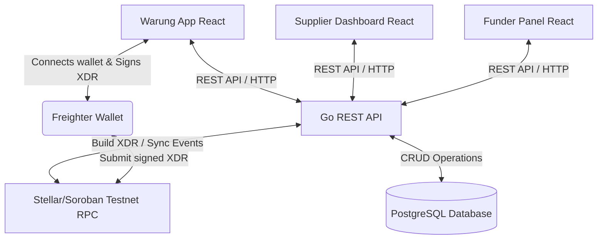

# Architecture Design - Warung Supplier Credit

This document describes the technical architecture of the **Warung Supplier Credit** system, a supplier financing platform built on the Stellar network.

## 1. Architectural Overview

The application follows a hybrid architecture, separating off-chain business state from trust-critical on-chain financial operations:

## 2. Core Components

### A. Frontend (React + Vite + TypeScript)
- **Role Interfaces**: Tailored UI views for Warung (mobile-first), Supplier (desktop), and Funder/Admin (desktop).
- **Wallet Wallet Integration**: Interacts with the **Freighter Wallet Extension** via `@stellar/freighter-api` to request user account addresses, enforce network policies (Testnet), and sign transaction payloads (XDR).

### B. Backend API (Golang)
- **REST Service**: Provides endpoints for managing profiles, catalog products, credit requests, and sync histories.
- **Transaction Orchestration**: Fetches wallet account sequence numbers, parses Soroban parameters, and packages contract actions into unsigned Stellar Transaction XDR formats.
- **Auto-Escrow Creation**: Uses server keys to sign and execute `create_invoice` on-chain.
- **Event Syncing**: Polls or handles contract event histories to automatically update the local database state.

### C. Smart Contract (Soroban Rust)
- **Escrow Logic**: Holds and manages the lifecycle of the funding assets locked for each invoice.
- **Reputation Ledger**: Updates and stores individual warung reputational scores based on repayment behaviors.

### D. Database (PostgreSQL)
- Serves as the high-performance local store for off-chain metrics, customer details, product inventories, and full repayment scheduling.
